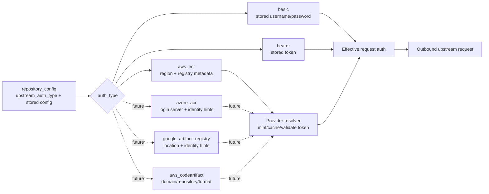

# Dynamic Managed Upstream Auth Design

## Purpose

Artifact Keeper already supports static upstream Basic and Bearer credentials.
Managed artifact services such as Amazon ECR, Azure Container Registry, Google
Artifact Registry, and AWS CodeArtifact mint short-lived credentials through
cloud-native identity flows instead. The backend needs a model that can support
those providers without storing generated tokens or coupling every future
provider to the first ECR implementation.

The first implementation should stay intentionally small: ECR for OCI registry
remotes. This design note captures the extension point so future providers can
follow the same shape.

## Goals

- Split stored upstream auth configuration from resolved on-the-wire auth.
- Use cloud default credential chains at runtime instead of storing cloud access
  keys in repository config.
- Cache generated credentials in memory only, with provider-specific expiry.
- Keep generated tokens out of logs, debug output, API responses, and persisted
  repository configuration.
- Make ECR the first provider without baking AWS assumptions into proxy call
  sites.
- Leave clear room for later Azure, Google, and CodeArtifact providers.

## Non-Goals

- No web UI changes in the first ECR PR.
- No Azure, Google, or CodeArtifact implementation in the first ECR PR.
- No generated token persistence.
- No new documentation build tooling.

## Model

Static upstream auth can be both the stored config and the effective request
auth. Dynamic providers are different: the stored config selects a provider and
contains non-secret provider settings, while the effective auth is generated on
demand for a specific upstream request.

In the initial backend implementation, the resolver can return the existing
effective auth enum used by outbound requests. ECR resolves to Basic auth with
the Docker username convention `AWS` and the decoded ECR token as the password.
The important boundary is conceptual: stored provider config is not itself the
credential placed on the request.

## Provider Examples

| Provider | Stored config | Runtime identity source | Effective request auth |
|----------|---------------|-------------------------|------------------------|
| Static Basic | Username + encrypted password | None | Basic |
| Static Bearer | Encrypted token | None | Bearer |
| Amazon ECR | Region, optional registry/account metadata | AWS default credential chain | Basic as `AWS:<token>` |
| Azure Container Registry | Login server, optional tenant/client/identity hints | Managed identity or Entra token flow | Basic with ACR token-login username convention |
| Google Artifact Registry | Location/host metadata, optional workload identity hints | Application Default Credentials or workload identity | Basic as `oauth2accesstoken:<token>` |
| AWS CodeArtifact | Domain, owner, repository, format metadata | AWS default credential chain | Format-specific token usage |

CodeArtifact is intentionally listed separately from OCI registries. It may
share the provider-resolution model, but package-manager-specific transport
details should be designed when CodeArtifact support is actually implemented.

## Security Invariants

- Do not store cloud access keys in repository configuration.
- Do not persist generated provider tokens.
- Do not log generated tokens, decoded passwords, or full `Authorization`
  headers.
- Redact secret-bearing auth types in `Debug` output.
- Cache only in memory, per backend instance.
- Key dynamic-auth caches by non-secret identity dimensions such as provider,
  region/location, registry/account, and configured role or identity hint.
- Use provider-supplied absolute expiry when available, and refresh before the
  token is close to expiry.
- Validate that provider credentials are only applied to the intended upstream
  host shape.
- Verify redirects do not forward provider credentials to unrelated hosts.

## Extension Guidance

Adding a new managed-auth provider should require:

1. A stored config parser/validator for the provider.
2. A small provider boundary that can be faked in unit tests.
3. Request-host validation appropriate to that provider.
4. Cache-key and expiry rules that keep tokens separated across identities.
5. Tests proving the provider resolves to the expected effective request auth
   and does not leak credentials across redirects or unrelated hosts.

The proxy call sites should keep asking for effective upstream auth and should
not need provider-specific branching for every managed registry.
